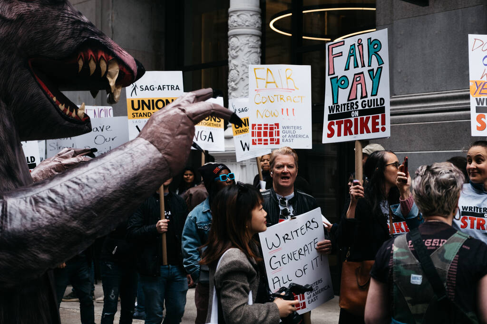

# Inteligencia artificial: la gran ilusión de la regulación
por Eric Sadin, Filosofo, Especialista Digital

El punto de inverso intelectual y creativo de la IA está abordando nuestras capacidades más fundamentales. 
Para el filósofo Eric Sadin, las diversas profesiones deben movilizarse para definir lo que están dispuestos
a ceder y negar la industria digital. De lo contrario, despertaremos en un mundo en el que seremos como extraños.

En una protesta de escritores estadounidenses contra las plataformas. Aquí, frente a las instalaciones de Netflix en Manhattan, el 3 de mayo de 2023. (Elsa Seignol/Hans Lucas)

Y si todos estuviéramos equivocados? A medida que la inteligencia artificial continúa interrumpiendo, de un lado a otro y a velocidad exponencial, nuestras vidas, imaginamos que hay un desfile que nos protegerá de las derivas principales: la regulación. Este es un hecho que nunca se cuestiona.

De hecho, esto es una ficción. En la medida en que lo que se entiende por este concepto, y las medidas adoptadas en estos ámbitos, no están en modo alguno a la altura de lo que está en juego.
Porque lo que se ha hecho durante unos 15 años? Un cambio en el estado de las tecnologías digitales, que ya no se destinan exclusivamente a la recogida, el almacenamiento, la indización y la manipulación de la información cada vez mayores para diversos fines. A partir de ahora, se les ha asignado otra misión: valorar secciones cada vez más extensas de lo real. Pero también recomendar en una función para actuar de tal manera como otra. Esta es la dimensión cognitiva y organizativa de la inteligencia artificial. En este arreglo, un arreglo reciente ha sido nuevo: los sistemas logran generar textos, imágenes y sonidos. O, lo que debe llamarse el punto de inflexual y creativo giro de la IA. Un ejemplo entre otros es que una multitud de libros ahora son escritos por las IA y vendidos en Amazon. Este salto tecnológico tiene tres consecuencias principales.

## Nuestro apoyo robótico

En primer lugar, son nuestras habilidades más fundamentales, las de producir símbolos, y sobre todo, de la lengua, es decir, construirnos como individuos sociales que están obligados a hablar en primera persona - que son llamados a ser atendidos por robots usando procesos matematizados, estandarizados e industrializados.

En segundo lugar, en un momento en que la mayoría de las profesiones están en servicio, involucrando nuestras facultades intelectuales y creativas como una cuestión prioritaria, cómo no podemos ver el huracán que está apuntando? En este sentido, es engañoso mencionar cualquier "complemento de máquina humana" o un aumento de "habilidades", el peor en Nolan hecho por el hombre, que sólo busca pasar las vejigas como linternas. La verdad es que en todas partes, si no tenemos cuidado, los sistemas que cuestan menos, realizarán tareas que anteriormente habíamos sido transferidos más rápidamente y supuestamente más eficazmente que nosotros mismos. Aquellos que a menudo requieren estudios largos y costosos proporcionan placer, tiempo para la sociabilidad y el reconocimiento. Estamos viviendo el fin del principio de que el economista Joseph Schumpeter es la destrucción creativa de la transferencia de puestos de trabajo que se han vuelto obsoletos, como resultado de las llamadas innovaciones de "breakthrough", a los nuevos puestos de trabajo.

En tercer lugar, las tecnologías están ahora disponibles para todo eso, en una simple instrucción (pronto), generan imágenes o videos que coincidan con los deseos o látigos de la gente, luego se inclinan a jugar con otros. Como los recientes farstos profundos, Joe Biden llamó a sus electores a no votar en las primarias de New Hampshire, o al contenido pornográfico de seudónimos que montó a la cantante Taylor Swift.

Estamos entrando en una era en la que ya no sabremos cuál es el origen y la conformidad de una imagen. O un régimen de indistinción pronto para ser generalizado, cargando muchos peligros. Porque la democracia no son sólo principios comunes, son tantos árbitros comunes, de lo contrario ya no nos entendemos, cada uno termina viendo sólo al mediodía en su puerta.

## Instalación y sordera

Ante temas de tal alcance, se imagina que el legislador, como un poder de magia que se le otorga, podrá encajar mejor las cosas. Al igual que la Ley de AI elaborada por la Unión Europea, que se presenta como la más "vinctiva del mundo", pero que no es del todo. Por la razón de que el texto se basa en una escala de supuestos riesgos (pilar de datos personales, sesgo discriminatorio, calificación social, etc.). Todos estos son puntos, ciertamente importantes, entre otros, pero todos los cuales ocultan las tres rupturas de civilización que se están tratando. Es decir, la creciente automatización de los asuntos humanos, la desintegración de nuestras facultades fundamentales y una sordera siempre tensa entre los seres. Al mismo tiempo, la voluntad declarada no es frenar la innovación digital. El mismo que apoya estos procesos en curso.

En esto, esta ecuación, que lleva unos 15 años en vigor en la industria digital, que está trazando una línea de compartir entre las amenazas y los supuestos beneficios, está equivocada. Porque esto hace que las sentencias subjetivas, cuestionables, sobre todo se refieren a la primacía económica y estén sujetas a prácticas de cabildeo incesantes.

Por eso es muy diferente, y una ecuación doble, que debería preferirse. Por un lado, el que distingue entre los casos en los que tenemos la mano y dónde no la tenemos. Como muchos ejemplos, los métodos gerengiles indignos que están en el mundo de la logística, ver los sistemas de IA dictar a los manejadores los gestos correctos para realizar y a un ritmo de tan alta velocidad, reduciéndolos a robots de carne y sangre.

Por otro lado, a ella que le importa preservar, ser mantenida como intangible, por nuestros principios cardinales: libertad, integridad, dignidad, creatividad humana. De lo contrario, hay que oponerse a un rechazo categórico. Y luego tenemos criterios de valor universal, lo que permite determinar más allá de los tropismas particulares y los intereses privados.

## Movilización más que regulación

En la salida, pronto nos daremos cuenta de que es mucho más movilización que la regulación que necesitamos. Estos son los escritores de Hollywood, que pronto aprovecharon que sus oficios estaban amenazados y que, en mayo de 2023, se pusieran de pie en gran número, con valor y determinación, y finalmente ganaran. Sin apostar por ninguna regulación que sólo perdonaría a la cabra y la col, en última instancia llévenlas al andardado.

En este punto, sería apropiado para todas las profesiones puestas en riesgo por las IAs generadoras (la lista podría ser desmotado en páginas largas, mencionando, entre otros, periodistas, diseñadores gráficos, traductores, abogados, médicos, maestros, etc.), movilizarse a nivel nacional, pero también internacional, por federación y decir, en nombre de sus demandas, lo que están listos y lo que rechazan categóricamente. Sin esperar nada, ni por delante del legislador, ciega tantas realidades de nuestra vida cotidiana.

Es como si hubiéramos estado repitiendo los mismos errores durante décadas. Sabemos que lo que condujo al desastre ambiental, a multitudes de seres destruidos por lógicas de gestión implacables, al retiro de los servicios públicos, a menudo dependían de las leyes, presentadas como saludables, que se hicieron realidad demasiado tarde de que simplemente estaban apoyando dinámicas perjudiciales?

No tiene sentido gritar nuestros resentimientos contra los gobernantes y las instituciones, si no aprendemos de la historia. Es decir, dejar de depender únicamente de los representantes, de actuar sobre nosotros de manera diferente. De lo contrario, uno despertará una buena mañana en un mundo con respecto al cual nos sentiremos como extraños.

Porque la pregunta filosófica que nos preocupa es la de "en la edad en que los sistemas omniscientes se mantienen su camino, hablan en nuestro nombre y producen símbolos - lo que es exactamente nuestro papel en la Tierra. Se comprometerá a ser sólo espectadores pasivos de fenómenos impulsados por lógicas que nos serán impenetrables, al tiempo que ha renunciado a la expresión de nuestras facultades? O, por el contrario, queremos celebrar nuestro impulso vital y el genio que se acomoda en todos nosotros?

Hoy en día, estamos viviendo en un momento crucial, porque estamos molestos por incesantes trastornos - con alcance antropológico - donde, durante unos años, todavía hay márgenes para decidir qué modos de vida y organización común queremos. Y entonces sería una sociedad plenamente democrática que, confiando en sus preceptos más esenciales, finalmente querría mantenerlos contra vientos y mareas muy poderosos.

Eric Sadin es el autor de la Vida Espectral. Pensando en la era de los metaversales y los asolos generadores, Grasset Ediciones, 2023.
